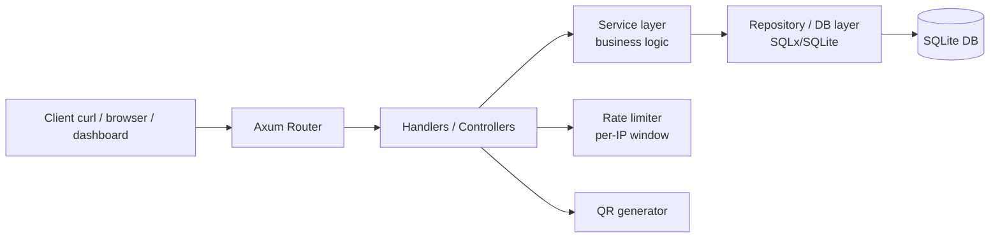

# Architecture

## Overview

This project is a URL shortener service with analytics, implemented as a single Rust backend application.

Core responsibilities:
- Create short links (random or custom codes)
- Redirect short code -> original URL
- Record click events and expose analytics
- Apply per-IP rate limiting on write endpoints
- Optional extras: expiration dates, QR code generation

Tech stack:
- HTTP server: Axum
- Persistence: SQLite
- Schema management: SQL migrations
- Tests: integration tests under `tests/`

## High-level diagram

